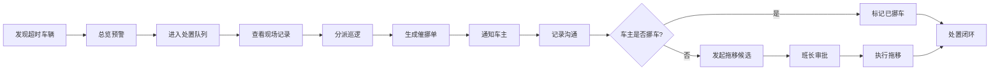

## 1. 产品概述

面向商场、园区和写字楼安保班组的桌面端值守看板系统，聚焦疑似僵尸车和长期占位车的现场处置闭环。通过"快看、快派、快闭环"的设计理念，提升安保班组对超时停车问题的处置效率。

- 解决问题：僵尸车识别难、派单流程繁、处置闭环慢、绩效统计缺
- 目标用户：安保值班员、安保班长、停车场主管
- 产品价值：缩短超时车辆处置周期 60%，规范交接班流程，提升车位周转率

## 2. 核心功能

### 2.1 用户角色

| 角色 | 登录方式 | 核心权限 |
|------|----------|----------|
| 值班员 | 工号登录 | 筛查车辆、分派巡逻、记录沟通、标注挪车、交接班 |
| 安保班长 | 工号登录 | 全部值班员权限 + 查看绩效、拖移审批、重点区域配置 |
| 主管 | 工号登录 | 全部权限 + 数据报表、系统配置 |

### 2.2 功能模块

1. **总览窗口**：超时统计概览、区域拥堵热力、待处置队列、实时预警
2. **处置队列**：超时车辆列表、批量操作、状态流转、优先级标记
3. **现场记录**：巡更拍照、进出场时间、车牌比对、历史占位记录、拥堵影响分析
4. **重点区域**：区域筛查、夜间锁定、阈值配置、车位占用监控
5. **交接班**：班次交接备注、未完成项移交、班次绩效汇总

### 2.3 页面详情

| 页面名称 | 模块名称 | 功能描述 |
|-----------|-------------|---------------------|
| 总览窗口 | 数据概览卡 | 显示超时车辆总数、待处置数、已挪车数、拖移候选数，按严重程度颜色区分 |
| 总览窗口 | 区域拥堵热力 | 各区域超时车辆数量热力图，点击跳转对应区域车辆列表 |
| 总览窗口 | 实时预警栏 | 滚动显示新发现的超时车辆、高优先级告警 |
| 总览窗口 | 处置进度环 | 本班次处置完成率环形图、平均处置时长 |
| 处置队列 | 筛选工具栏 | 按区域、超时时长、车牌、处置状态筛选 |
| 处置队列 | 车辆列表 | 车牌、车型、颜色、区域、泊车位、超时时长、状态标签、操作按钮 |
| 处置队列 | 批量操作 | 批量分派巡逻、批量生成催挪单、批量标记 |
| 处置队列 | 车辆详情抽屉 | 展示完整车辆信息、历史记录、操作时间线 |
| 现场记录 | 巡更拍照 | 显示巡逻员上传的现场照片，支持放大查看、拍照时间、拍摄人 |
| 现场记录 | 进出场时间 | 入场时间、出场时间（预计/实际）、累计停留时长 |
| 现场记录 | 车牌比对 | 车牌识别结果与登记信息比对，高亮差异项 |
| 现场记录 | 历史占位记录 | 该车牌历史超时记录、次数、累计时长 |
| 现场记录 | 拥堵影响 | 显示该车位被占用期间的周边车位周转率、排队时长影响 |
| 现场记录 | 处置操作区 | 分派巡逻、生成催挪单、车主通知、电话沟通记录、标注已挪车、发起拖移 |
| 重点区域 | 区域列表 | 各区域名称、车位总数、已占用数、超时数、夜间锁定状态 |
| 重点区域 | 区域详情 | 车位布局图，标记超时车位，支持直接操作 |
| 重点区域 | 夜间锁定配置 | 设置重点区域夜间锁定时段、超时阈值、告警方式 |
| 重点区域 | 阈值配置 | 各区域超时判定阈值、警告阈值、拖移阈值 |
| 交接班 | 交接摘要 | 本班次关键数据、未完成处置项、待跟进事项 |
| 交接班 | 交接备注 | 文字备注、上传附件、标记重要事项 |
| 交接班 | 班次绩效 | 处置数量、平均响应时长、平均处置时长、车主联系成功率 |
| 交接班 | 班次交接 | 确认交接、移交未完成项生成交接单 |

## 3. 核心流程

### 3.1 超时车辆处置流程

值班员登录系统 → 总览查看待处置车辆 → 进入处置队列筛选 → 选择超时车辆 → 查看现场记录（拍照/进出场/历史）→ 评估拥堵影响 → 分派巡逻员现场核验 → 巡逻员反馈后生成催挪单 → 联动通知车主 → 记录电话沟通内容 → 车主挪车后标记已挪车 → 拒不挪车发起拖移候选 → 班长审批后执行拖移 → 车辆离场闭环

### 3.2 交接班流程

上班次值班员 → 查看本班次绩效 → 填写交接备注 → 移交未完成项 → 确认交接 → 下班次值班员登录 → 查看交接内容 → 确认接收 → 开始新班次

## 4. 用户界面设计

### 4.1 设计风格

- **整体调性**：工业安防风格，深色主题，高对比度，功能优先
- **主色调**：深蓝 `#0f172a` 为底色，警戒橙 `#f97316` 标记超时，告警红 `#ef4444` 标记严重，成功绿 `#10b981` 标记完成
- **字体**：显示字体用 Orbitron（数字/车牌），正文字体用 Noto Sans SC，等宽字体用 JetBrains Mono
- **按钮风格**：直角矩形、1px 边框、hover 时边框发光、点击下陷效果
- **布局**：4-5 个可拖拽窗口，支持分屏停靠，信息密度高但层次分明
- **图标**：Lucide 线性图标，高对比度配色
- **动效**：预警脉冲动画、状态切换过渡、窗口拖拽平滑

### 4.2 页面设计概述

| 页面名称 | 模块名称 | UI 元素 |
|-----------|-------------|-------------|
| 总览窗口 | 数据概览卡 | 大号数字、渐变色背景、脉冲预警动画、底部趋势小图表 |
| 总览窗口 | 区域热力图 | 网格布局、颜色深浅表示超时数量、点击缩放 |
| 处置队列 | 车辆列表 | 斑马纹行、状态色标签、车牌等宽字体、操作按钮常驻 |
| 处置队列 | 详情抽屉 | 右侧滑入、时间线布局、照片网格、操作区固定底部 |
| 现场记录 | 照片查看器 | 网格布局、灯箱效果、EXIF 信息展示 |
| 重点区域 | 车位布局 | 可视化车位图、不同颜色表示占用状态、悬停显示详情 |
| 交接班 | 绩效卡片 | 数据可视化图表、对比指标、等级评定 |

### 4.3 响应式

- 桌面端优先设计，适配 1920×1080 及以上分辨率
- 支持多窗口拖拽、停靠、最大化/还原
- 窗口内容区域独立滚动，不影响整体布局
- 适配触控屏操作，按钮最小尺寸 44×44px
