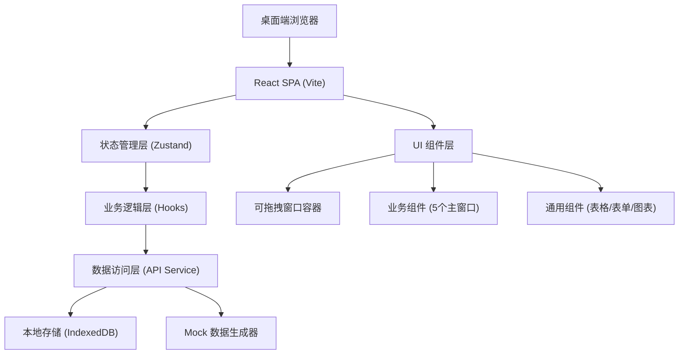
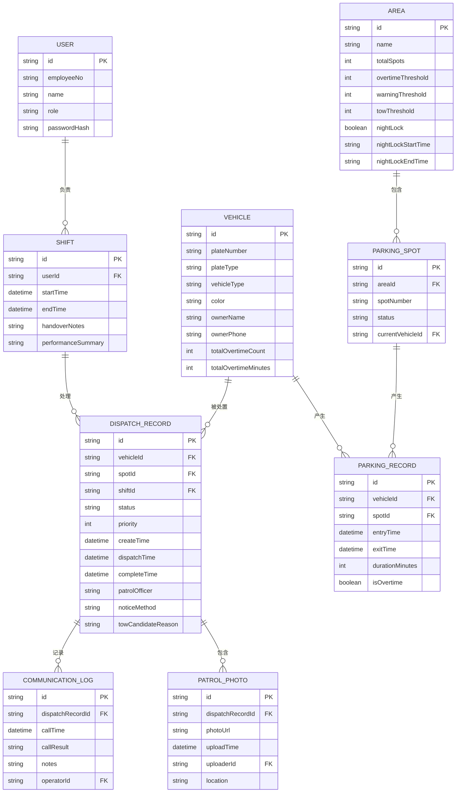

## 1. 架构设计

本项目采用纯前端 + Mock 数据的架构，所有数据存储在浏览器本地（localStorage/indexedDB），模拟真实后端接口。前端采用 React + TypeScript + Vite 技术栈，状态管理使用 Zustand，UI 样式使用 TailwindCSS。



## 2. 技术描述

- **前端框架**: React@18 + TypeScript
- **构建工具**: Vite@5
- **状态管理**: Zustand@4
- **路由**: React Router DOM@6
- **样式**: TailwindCSS@3 + CSS 变量
- **图标**: Lucide React
- **图表**: Recharts（轻量级图表库）
- **拖拽**: 自定义实现（基于 React Draggable 思路）
- **本地存储**: IndexedDB（使用 idb 库封装）
- **后端**: 无后端，纯前端 Mock 数据
- **数据持久化**: 浏览器 IndexedDB + localStorage

## 3. 路由定义

| 路由 | 用途 |
|-------|---------|
| `/` | 主看板页面，包含 5 个可拖拽窗口 |
| `/login` | 登录页面 |

## 4. 数据模型

### 4.1 数据模型定义



### 4.2 TypeScript 类型定义

```typescript
// 用户类型
interface User {
  id: string;
  employeeNo: string;
  name: string;
  role: 'guard' | 'leader' | 'manager';
}

// 班次类型
interface Shift {
  id: string;
  userId: string;
  userName: string;
  startTime: Date;
  endTime?: Date;
  handoverNotes?: string;
  performanceSummary?: PerformanceSummary;
  unfinishedItems: string[];
}

// 车辆类型
interface Vehicle {
  id: string;
  plateNumber: string;
  plateType: 'blue' | 'green' | 'yellow' | 'white';
  vehicleType: 'sedan' | 'suv' | 'truck' | 'van' | 'motorcycle';
  color: string;
  ownerName: string;
  ownerPhone: string;
  totalOvertimeCount: number;
  totalOvertimeMinutes: number;
}

// 区域类型
interface Area {
  id: string;
  name: string;
  totalSpots: number;
  occupiedSpots: number;
  overtimeSpots: number;
  overtimeThreshold: number;
  warningThreshold: number;
  towThreshold: number;
  nightLock: boolean;
  nightLockStartTime: string;
  nightLockEndTime: string;
}

// 车位类型
interface ParkingSpot {
  id: string;
  areaId: string;
  spotNumber: string;
  status: 'available' | 'occupied' | 'overtime' | 'reserved';
  currentVehicleId?: string;
  currentPlate?: string;
}

// 停车记录
interface ParkingRecord {
  id: string;
  vehicleId: string;
  spotId: string;
  entryTime: Date;
  exitTime?: Date;
  durationMinutes: number;
  isOvertime: boolean;
}

// 处置记录
interface DispatchRecord {
  id: string;
  vehicleId: string;
  vehicle: Vehicle;
  spotId: string;
  spotNumber: string;
  areaId: string;
  areaName: string;
  shiftId: string;
  status: DispatchStatus;
  priority: 'low' | 'medium' | 'high' | 'urgent';
  createTime: Date;
  dispatchTime?: Date;
  completeTime?: Date;
  patrolOfficer?: string;
  noticeMethod?: 'sms' | 'phone' | 'app';
  towCandidateReason?: string;
  historyRecords: ParkingRecord[];
  photos: PatrolPhoto[];
  communicationLogs: CommunicationLog[];
  congestionImpact: CongestionImpact;
}

// 处置状态
type DispatchStatus = 
  | 'pending' 
  | 'dispatched' 
  | 'notice_sent' 
  | 'communicating' 
  | 'moved' 
  | 'tow_candidate' 
  | 'tow_approved' 
  | 'tow_executed' 
  | 'closed';

// 沟通记录
interface CommunicationLog {
  id: string;
  dispatchRecordId: string;
  callTime: Date;
  callResult: 'connected' | 'no_answer' | 'refused' | 'promised';
  notes: string;
  operatorId: string;
  operatorName: string;
}

// 巡更照片
interface PatrolPhoto {
  id: string;
  dispatchRecordId: string;
  photoUrl: string;
  uploadTime: Date;
  uploaderId: string;
  uploaderName: string;
  location: string;
}

// 拥堵影响
interface CongestionImpact {
  queueLength: number;
  waitingCars: number;
  affectedSpots: number[];
  turnoverRateReduction: number;
}

// 绩效汇总
interface PerformanceSummary {
  totalDispatched: number;
  completedCount: number;
  averageResponseMinutes: number;
  averageProcessMinutes: number;
  contactSuccessRate: number;
  movedCount: number;
  towCandidateCount: number;
}

// 催挪单
interface NoticeForm {
  id: string;
  dispatchRecordId: string;
  plateNumber: string;
  spotNumber: string;
  areaName: string;
  overtimeDuration: string;
  generateTime: Date;
  expiryTime: Date;
}
```

### 4.3 Mock 数据说明

- 使用 Faker.js 生成模拟数据
- 预置 5 个区域（A/B/C/D/E 区）
- 预置 3-5 名巡逻员
- 预置 20-30 辆超时车辆，超时时长从 4 小时到 7 天不等
- 预置历史占位记录，每辆车 3-10 条历史记录
- 预置巡更照片（使用占位图片服务）
- 数据初始化在应用启动时完成，存储在 IndexedDB
